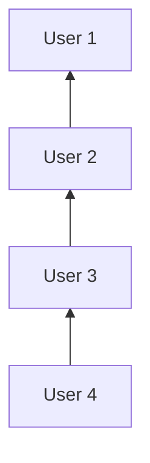

# Affiliate sistem 

```mermaid
graph BT
    A[User 1];
    B[User 2] --> A;
    C[User 3] --> B;
    D[User 4] --> C;
```

Kada registrujemo novog korisnika, ko je koga preporucio u sistem. Imamo podatak kome pripada koliko procenata uplate.

- Korisnik koji nije nikoga preporucio plati 100 jedinica pretplatu, cela preplata ide kompaniji. 
- Kada korisnik koji ima pretka uplati 100 jedinica, pogledamo ko je njegov prvi otac, njegovom racunu dodelimo prvi procenat, od uplacenih jedinica, a od kompanije oduzmemo. Pogledamo da li i otac ima oca, i ako ima uplatimo drugi procenat njegovom racunu, a od kompanije oduzmemo. Pogledamo opet do konfigurisanog nivoa predaka, ili do prvog samo registrovanog korisnika, koji nema pretka.

Zbog toga moramo imati racunovodstvo svakog korisnika kada je dobio deo registracije i kada je uzeo deo te zarade. Prikaz korisnikovih komisija i isplata.

## TODO
+ napravi registraciju korisnika
+ logovanje registrovanog korisnika i prikaz affiliate linka
+ napravi registracija affiliate korisnika
- napravi uplate za sve nivoe korisnika
- napraviti proveru da li su sredstva legla na racun u tek onda aktivirati da je uplata prosla korisniku u admin delu
- tri nivoa 15%, 4%, 1%
- ide procesoru fee oko 15-17%, 
- (jednog dana ako ima povracaja)
- prikazi za svakog korisnika komisiono stanje, svih uplata, i isplata
- napravi isplatu korisnika
- napravi prikaz stanja kompanije

napravi rutinu bar 2-3h 

