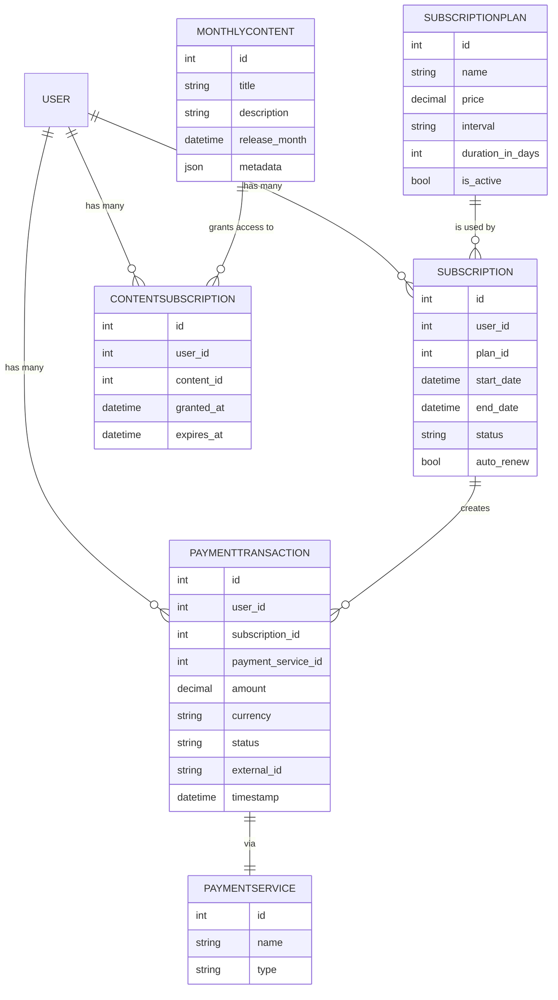

Korisnik vrsi uplatu, ta uplata je u stanju mirovanja dok ne dobijemo od banke poruku da je sve ok, i da je i banka uzela deo, ili da je doslo do greske, pa je uplata nevazeca.

Kada je uplata prosla, najvise tri oca korisnika dobijaju komisiju po procentnoj skali 15, 3, 2

Kada uplata ne prodje onda niko ne dobija nista. 
Svaki korisnik koji ima sredstva od komisije, moze da ih podigne i onda mu se saldo na osnovu toga smanjuje.

Uplate, isplate bankovni fee, isplata na racun komisije, isplata povratak sredstava 
comision uplata, komisija isplata

## VIP Membership
mesecno clanstvo u sistemu

## Tipster
pretplata na redovno pracenje zanimljivih tipstera

